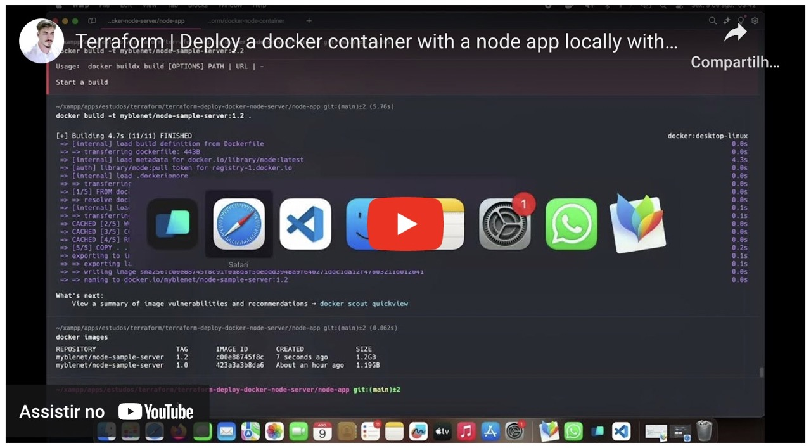

# Local Deployment of Node.js Application with Docker

This repository contains a Node.js application that can be easily deployed locally using Docker. Follow the steps below to get your application up and running.

## DEMO

Check out the demonstration of deploying a Docker container with a Node.js application:

[Watch the video](https://www.youtube.com/watch?v=cyNWolqg7Z8)


<iframe width="712" height="390" src="https://www.youtube.com/embed/cyNWolqg7Z8" title="Deploy a Docker Container with a Node.js App Locally" frameborder="0" allow="accelerometer; autoplay; clipboard-write; encrypted-media; gyroscope; picture-in-picture; web-share" referrerpolicy="strict-origin-when-cross-origin" allowfullscreen></iframe>

## Prerequisites

Before you begin, ensure you have the following installed on your machine:

- [Docker](https://docs.docker.com/get-docker/) - Follow the instructions for your operating system to install Docker.

## Getting Started

1. **Clone the Repository**

   First, clone this repository to your local machine:

   ```bash
   git clone https://github.com/howmarketing/terraform-deploy-docker-node-server.git
   cd terraform-deploy-docker-node-server
   ```

2. **Build the Docker Image (Optional)**

   > _Note: This step is not necessary if you are using the pre-built image `myblenet/node-sample-server:1.0` available on Docker Hub._

   If you want to build the Docker image yourself, navigate to the `node-app` directory and build the image:

   ```bash
   cd node-app
   docker build -t myblenet/node-sample-server:1.0 .
   cd ..
   ```

3. **Deploy Using Terraform**

   Initialize and apply the Terraform configuration to deploy your Node.js application in a Docker container:

   ```bash
   terraform init
   terraform plan
   terraform apply
   ```

4. **Check Your Container Status**

   Verify that your Docker container is running:

   ```bash
   docker ps
   ```

   Alternatively:

   ```bash
   docker container list --all
   ```

   

5. **Run the Docker Container Manually (Optional)**

   If you prefer to run the Docker container manually for testing, use the following command:

   ```bash
   docker run --name test_node_app -p 8080:3000 -d myblenet/node-sample-server:1.0
   ```

   This maps port 8080 on your local machine to port 3000 in the Docker container. Adjust port numbers if needed.

6. **Access Your Application**

   Open your web browser and go to `http://localhost:8080` (or the port you mapped). You should see your Node.js application running.

   

## Dockerfile

Here’s the `Dockerfile` used to containerize the Node.js application:

```dockerfile
# Use the official Node.js image.
FROM node:latest

# Set the working directory.
WORKDIR /usr/src/app

# Copy package.json and package-lock.json.
COPY package*.json ./

# Install dependencies.
RUN npm install

# Copy the rest of your application code.
COPY . .

# Expose the port your app will run on.
EXPOSE 3000

# Command to run your app.
CMD ["node", "server.js"]
```

## Troubleshooting

- **Port Already in Use:** If you encounter issues with the port being in use, stop other services using the same port or choose a different port.
- **Permission Issues:** Ensure you have the necessary permissions to run Docker commands. You might need to prepend `sudo` to Docker commands on some systems.

## Additional Resources

- [Docker Documentation](https://docs.docker.com/)
- [Node.js Documentation](https://nodejs.org/en/docs/)

Feel free to contribute or open issues if you encounter any problems. Happy coding!
