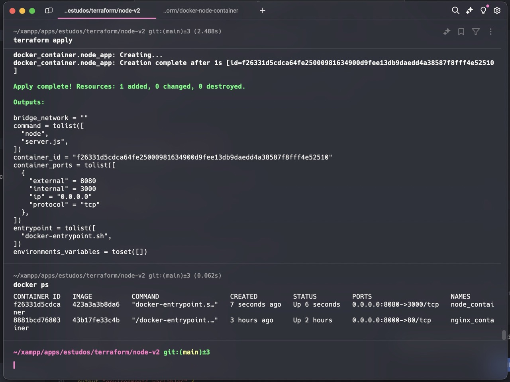
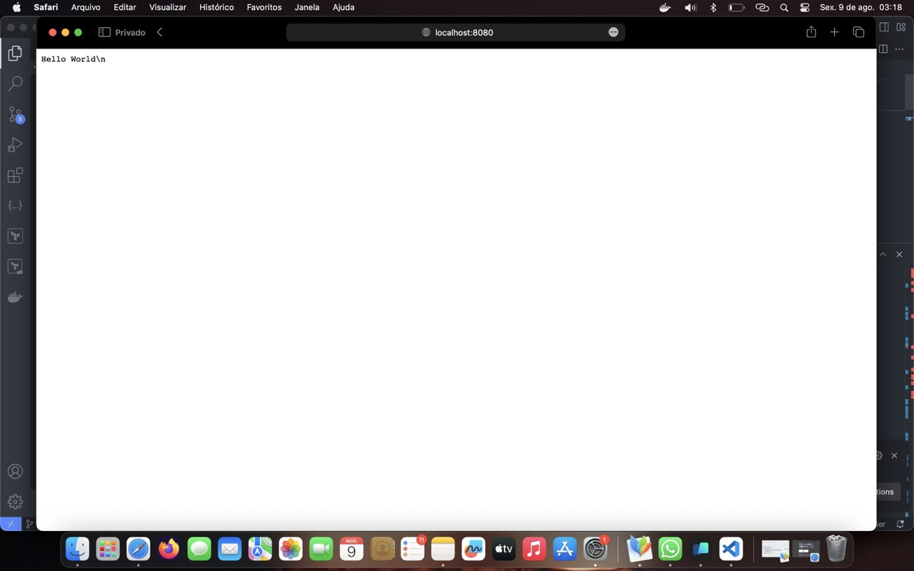

# Local Deployment of Node.js Application with Docker

This repository contains a Node.js application that can be easily deployed locally using Docker. Follow the steps below to get your application up and running.

**DEMO**

[https://www.youtube.com/watch?v=cyNWolqg7Z8](https://www.youtube.com/watch?v=cyNWolqg7Z8)

<iframe width="712" height="390" src="https://www.youtube.com/embed/cyNWolqg7Z8" title="Terraform | Deploy a docker container with a node app locally with Terraform" frameborder="0" allow="accelerometer; autoplay; clipboard-write; encrypted-media; gyroscope; picture-in-picture; web-share" referrerpolicy="strict-origin-when-cross-origin" allowfullscreen></iframe>

## Prerequisites

Before you begin, ensure you have the following installed on your machine:

- [Docker](https://docs.docker.com/get-docker/) - Follow the instructions for your operating system to install Docker.

## Getting Started

1. **Clone the Repository**

   First, clone this repository to your local machine:

   ```bash
   git clone https://github.com/howmarketing/terraform-deploy-docker-node-server.git
   cd ./terraform-deploy-docker-node-server/
   ```

2. **Build the Docker Image**
   
   > _NOT NECESSARY STEP AS THE IMAGE `myblenet/node-sample-server:1.0` IT IS ALREADY COMMITED TO THE DOCKER-HUB_
   >
   
   Build the Docker image from the Dockerfile in the repository:

   ```bash
   cd node-app/ && docker build -t myblenet/node-sample-server:1.0 . && cd ..
   ```

3. **Terraform - Deploy your node app (docker container with an node server)**
  
  ```bash
  terraform init
  terraform plan
  terraform apply
  ```

4. **Check your container status**
  
  ```bash
  docker ps
  ```
  
  or

  ```bash
  docker container list --all
  ```

  


5. **Running manually the Docker Container**
  Run a manual version of container from the image you just built if you would like to manually test it:

   ```bash
   docker run --name test_node_app -p 8080:3000 -d myblenet/node-sample-server:1.0
   ```

   This command maps port 8080 on your local machine to port 3000 in the Docker container. Adjust the port numbers as needed if your application uses a different port.

6. **Access Your Application**

   Open your web browser and go to `http://localhost:8080` (or the port you mapped). You should see your Node.js application running.

   

## Dockerfile

Here's the `Dockerfile` used to containerize the Node.js application:

```dockerfile
# Use the official Node.js image.
FROM node:latest

# Set the working directory.
WORKDIR /usr/src/app

# Copy package.json and package-lock.json.
COPY package*.json ./

# Install dependencies.
RUN npm install

# Copy the rest of your application code.
COPY . .

# Expose the port your app will run on.
EXPOSE 3000

# Command to run your app.
CMD ["node", "server.js"]
```

## Troubleshooting

- **Port Already in Use:** If you encounter issues with the port being in use, you may need to stop other services using the same port or choose a different port.
- **Permission Issues:** Ensure you have the necessary permissions to run Docker commands. You might need to prepend `sudo` to Docker commands on some systems.

## Additional Resources

- [Docker Documentation](https://docs.docker.com/)
- [Node.js Documentation](https://nodejs.org/en/docs/)

Feel free to contribute or open issues if you encounter any problems. Happy coding!
